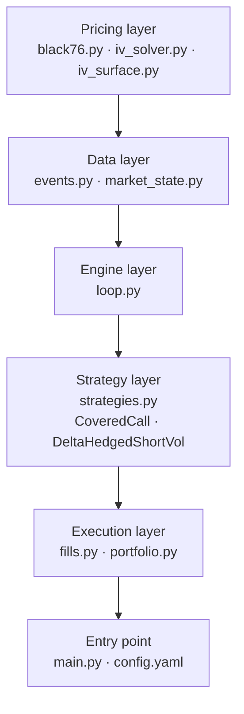

# BTC Options Backtesting System

An event-driven backtesting system for BTC options on Deribit, built across
five phases: Black-76 pricer with IV surface, event engine with MarketState,
strategy layer, execution layer with portfolio accounting, and a config-driven
entry point. Look-ahead bias is eliminated by construction, each strategy
receives only the MarketState at the current event timestamp, never future data.

## Quickstart

```bash
pip install -r requirements.txt
python main.py
# Reports written to reports/CoveredCall/ and reports/DeltaHedgedShortVol/
```

## System design and architecture

The system replays 1.24M events (quote snapshots and 1-minute candles,
Dec 15–31 2025) in strict chronological order through a five-layer pipeline:

```
Event stream
│
▼
MarketState        ← updates BBO, IV, Greeks per instrument per tick
│
▼
Strategy           ← reads state, emits Orders
│
▼
FillSimulator      ← fills at real bid/ask, converts BTC→USD
│
▼
Portfolio          ← WAC accounting, mark-to-model PnL, reporting
```




### Event ordering

Within a shared timestamp, events are processed in priority order:

1. Forward/future quotes (priority 0) - F must be current before option IV is solved
2. Option quotes (priority 1) - IV and Greeks computed using the fresh F
3. Candle bars (priority 2) - stored in MarketState, not fed into pricer

### Look-ahead protection

The event loop asserts `order.timestamp <= event.timestamp` on every emitted
order. Strategies receive only the current `Event` and current `MarketState`
through `on_event()`.

## Key design decisions

### Black-76 on the forward, not Black-Scholes on spot

BTC options are priced using Black-76, which is the correct model for options on futures contracts. Black-76 takes the futures price F directly as the forward, with r=0. Carry, funding rates, and basis are already embedded in the futures price by arbitrage. Furthermore, the dataset provided futures prices rather than spot, which makes Black-76 the natural and theoretically correct choice. Using Black-Scholes on spot would require separately estimating carry costs for BTC, which are ambiguous and unstable.

### IV solved on real quote events only

The original approach solved IV on every row of the forward-filled 5-second
grid which is around ~2.9M brentq calls, estimated at 30 minutes runtime. More importantly,
solving IV from a stale (forward-filled) price produces a meaningless implied
vol: the market did not quote that price at that timestamp.

The fix: solve IV only on the ~673K real quote events, then forward-fill the
IV surface. This is both faster (4×) and more correct.

### Delta threshold rehedging, not time-based

`DeltaHedgedShortVol` rehedges when `|portfolio delta| > 0.05`, not on a
fixed time interval. This avoids unnecessary trades in quiet periods and
ensures rehedging is proportional to actual risk drift. The threshold is
configurable in `config.yaml`.

### Stale flag at 15-minute threshold

Any instrument with no real quote for more than 15 minutes is marked stale.
Stale IV is not used for marking positions or computing Greeks. This threshold
was chosen based on Phase 0 observations where maximum quote gaps were ~30 minutes
even for illiquid strikes, so 15 minutes gives a conservative but not
over-restrictive boundary.

## Data observations

### Quote structure

Quotes are event-driven, not regular 5-second snapshots. A new row only
appears when the bid or ask changes. Result: 70–87% of 5-second slots are
empty per instrument. Handled by forward-filling the IV surface after solving
on real events only.

### Volatility smile

The IV surface shows a clear smile with put skew:

| Strike | Median IV |
|--------|-----------|
| 70K    | 53.9%     |
| 90K (ATM) | 42.2% |
| 110K   | 44.0%     |

The left wing is significantly higher than the right, reflecting asymmetric
fear of downside moves.

### Christmas liquidity gap

Two notable gaps in ATM option quotes:
- ~38 hours: Dec 16–17
- ~90 hours: Dec 22–26 (Christmas period)

During these gaps, `DeltaHedgedShortVol` could not rehedge and
mark-to-market was frozen on stale IV. Equity curves are flat during these
periods.

## Assumptions

| Assumption | Rationale |
|---|---|
| r = 0 | Carry embedded in forward price; no unambiguous crypto risk-free rate |
| Expiry = 2026-01-30 08:00 UTC | Deribit standard option expiry time |
| Fill at bid/ask | Assumes aggressor crosses the spread on every order |
| Full fills, no partial fills | Order sizes (≤1 BTC) are small relative to typical top-of-book depth |
| No transaction fees | Deribit charges ~0.03% per option trade; omitted for simplicity |
| No market impact | Position sizes too small to move the market materially |
| Assume fills | Strategy positions update immediately on order emit; no fill rejection |

## Strategy results (Dec 15–31 2025)

### CoveredCall

Long 1 forward + short 1 × 90K call. Single entry, hold to end of replay.

| Metric | Value |
|--------|-------|
| Total PnL | +$1,140.69 |
| Realized | $0.00 |
| Unrealized | +$1,140.69 |
| Cash | -$83,682.37 |
| Trades | 2 |
| Max drawdown | $2,953.80 |
| Sharpe (ann.) | 2.97* |

*Sharpe is artificially high over a 17-day window of steady theta decay.

All PnL is unrealized. Gain comes from theta
decay on the short call as BTC stayed below 90K for most of the period.
The equity curve shows choppiness in the first 4 days as delta noise from
BTC price moves competes with theta income, then a stable uptrend as time
decay dominates.

### DeltaHedgedShortVol

Short 1 × 90K call, delta-hedged via forward when |delta| > 0.05.

| Metric | Value |
|--------|-------|
| Total PnL | +$539.16 |
| Realized | -$849.51 |
| Unrealized | +$1,388.67 |
| Cash | -$34,624.63 |
| Trades | 25 |
| Max drawdown | $655.04 |
| Sharpe (ann.) | 0.27 |
| Hit rate | 0% |

The 0% hit rate on forward trades is expected. Delta hedging buys into
falling markets and sells into rising ones. The profit source is theta decay on the short option,
not directional forward trades.

Economics: theta income (+$1,388 unrealized) minus hedging friction (-$850
realized) = +$539 net.

## PnL attribution

First-order Taylor decomposition of PnL into delta, vega, and theta components
per sample interval: ΔV ≈ delta·ΔF + vega·Δσ + theta·Δt + residual.

CoveredCall: theta is the primary driver (~steady accumulation),
delta noise dominates early, vega secondary.

DeltaHedgedShortVol: theta harvesting offset by negative delta PnL
from rehedging friction. Vega is the primary unhedged risk factor —
strategy profits when IV is flat or falling, loses when IV spikes.
Residual captures short-gamma convexity drag not in the linear expansion.

## Scenario analysis

Entry positions stress-tested against a 7×5 grid of instantaneous
F shocks (±5%, ±10%, ±20%) and IV shocks (±5pts, ±10pts).

CoveredCall range: −$13,535 to +$5,888. Actual $1,141 INSIDE envelope —
consistent with flat BTC and mild IV decline over the period.

DeltaHedgedShortVol range: −$4,696 to +$1,259. Short-gamma profile
clearly visible — ±20% F shocks are deeply negative regardless of IV
direction. Actual $539 INSIDE envelope.

## Trade-offs and limitations

### What would I improve with more time

**Extend to full expiry cycle.** 17 days ending Dec 31 leaves 30 days to
the Jan 30 expiry. All PnL is unrealized. A full cycle would show whether the theta income survives a
large BTC move.

**Position sizing.** Both strategies use fixed 1 BTC notional. A proper
implementation would size positions based on portfolio Greeks limits, for
example, target vega exposure as a percentage of NAV.

**Transaction costs.** Deribit charges ~0.03% per option trade. Including
fees would reduce PnL by ~$3 per round trip and change the break-even
analysis for DHSV's rehedging frequency.

**Fill model depth.** The current simulator assumes infinite liquidity at
the top of book. For larger positions, a book-walking model with realistic
depth would be necessary.

**Rehedge sensitivity analysis.** The 0.05 delta threshold for DHSV is a
single point estimate. A sweep across [0.01, 0.02, 0.05, 0.10, 0.20] would
show the PnL vs transaction cost trade-off and give a more principled basis
for the parameter choice.

**Statistical robustness.** 17 days is insufficient for reliable Sharpe or
drawdown statistics. Bootstrap confidence intervals on Sharpe and a longer
dataset (minimum 3–6 months) would be needed for meaningful inference.

## File structure

```
├── main.py                  # entry point
├── config.yaml              # run parameters
├── pricing/
│   ├── black76.py           # Black-76 price + Greeks
│   ├── iv_solver.py         # brentq IV inversion
│   └── iv_surface.py        # IV surface build + cache
├── engine/
│   ├── events.py            # Event dataclass + loader
│   ├── market_state.py      # MarketState per-tick state
│   ├── loop.py              # event loop + hook
│   ├── strategies.py        # CoveredCall, DeltaHedgedShortVol
│   ├── fills.py             # FillSimulator
│   └── portfolio.py         # Portfolio + reporting
├── tests/
│   ├── test_strategies.py   # 19 unit tests
│   └── test_portfolio.py    # 17 unit tests
└── reports/
    ├── CoveredCall/
    └── DeltaHedgedShortVol/

Each strategy folder contains:
- `equity_curve.csv` / `equity_curve.png`
- `greek_log.csv` / `greeks_over_time.png`
- `trade_log.csv`
- `pnl_attribution.csv` / `pnl_attribution.png`
- `stress_test.csv` / `stress_test.png`
- `summary.txt`
```

## Running tests

```bash
python -m pytest tests/ -v
# 36 tests, 0 failures
```

## Sanity checks

- **IV round-trip**: price → IV → price back, relative error < 1e-7 across
  all (K, σ) pairs. Confirms pricer and solver are consistent inverses.
- **Greek bounds**: call delta ∈ (0,1), put delta ∈ (−1,0), gamma > 0,
  vega > 0, theta < 0. Verified across a test grid.
- **Put-call parity on pricer**: C − P = F − K holds to machine precision
  (< 1e-8) for all strikes. Catches sign errors in put formula.
- **Vol smile direction**: IV(70K) > IV(90K) and IV(110K) > IV(90K)
  confirmed on real data, wings price higher than ATM as expected.
- **Phase 0 parity check on market data**: max deviation 27.7% of F,
  4 lower-bound breaches, consistent with wide spreads, not data corruption.

## Out of scope

- No expiry settlement — replay ends 2025-12-31, options expire 2026-01-30. Mark-to-market via IV surface is fine.
- No American-style early exercise (everything is European).
- No funding-rate accounting on the perp — document if you assume zero.
- No live order book modelling beyond top-of-book mid + half-spread.